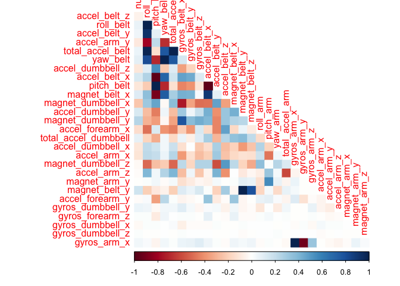
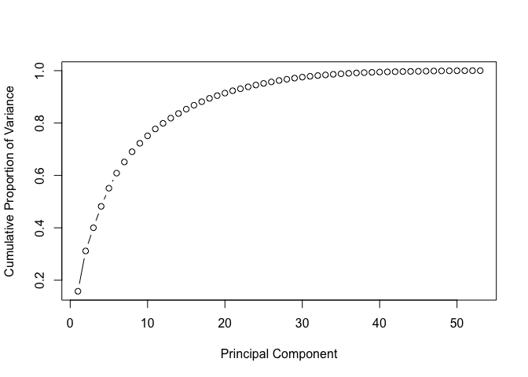

## Overview

Using devices such as Jawbone Up, Nike FuelBand, and Fitbit it is now possible to collect a large amount of data about personal activity relatively inexpensively. These type of devices are part of the quantified self movement – a group of enthusiasts who take measurements about themselves regularly to improve their health, to find patterns in their behavior, or because they are tech geeks. One thing that people regularly do is quantify how much of a particular activity they do, but they rarely quantify how well they do it. In this project, your goal will be to use data from accelerometers on the belt, forearm, arm, and dumbell of 6 participants. They were asked to perform barbell lifts correctly and incorrectly in 5 different ways. More information is available from the website [here](http://web.archive.org/web/20161224072740/http:/groupware.les.inf.puc-rio.br/har)
The goal of this project is to predict the manner in which they did the exercise (*classe* variable in the training set).
The training data for this project are available [here](https://d396qusza40orc.cloudfront.net/predmachlearn/pml-training.csv).
The test data are available [here](https://d396qusza40orc.cloudfront.net/predmachlearn/pml-testing.csv)
The data for this project come from this [source](http://web.archive.org/web/20161224072740/http:/groupware.les.inf.puc-rio.br/har.).

## Getting and Cleaning Data


```r
if (!"training" %in% ls()) training <- read.csv("./pml-training.csv", header = TRUE)
if (!"testing" %in% ls()) testing <- read.csv("./pml-testing.csv", header = TRUE)
```

The training data set is split 70-30 into a train and test data set.

```r
set.seed(2110)
intrain <- createDataPartition(training$classe, p = 0.7, list = FALSE)
train <- training[intrain, ]
test <- training[-intrain, ]
```

Variables that have near zero variance are not going to inpact the prediction much, so they're filtered out. Variables with a vast majority of NA (>75 %) are removed. The first 5 columns are also removed as they're ID information and don't help with predicting. 

```r
zero <- nearZeroVar(train)
train <- train[, -zero]
test <- test[, -zero]

not_nas <- sapply(train, function(i) mean(is.na(i)) < 0.75)
train <- train[, not_nas]
test <- test[, not_nas]

train <- train[, -(1:5)]
test <- test[, -(1:5)]
```

## Analysis of Predictors 

A closer look at the remaining variables by finding the correlation matrix tells me the variables which are correlated with correlation > 0.6 with each other

```r
cor_train <- rcorr(as.matrix(train[, -54]))
strong_correlation <- findCorrelation(cor_train$r, cutoff = 0.6)
strong_correlation
```

```
 [1] 11  2 10 23  5  4 37  9  3 12 38 36 39 48 31 35 22 40 24 26 13 49 33 47 32
[26] 34 19
```

```r
corrplot(cor_train$r[strong_correlation, ], type = "lower", method = "color")
```

<!-- -->

## Model Fitting 
The first attempt is to ignore the correlation matrix and fit a random forest model to the training data. Then, I predict with test data and compared the predictions using the confusion matrix, to find that we get an accuracy of around 99% with 95% confidence and hence based on the test data, the estimate of out of sample error is around 1%. Cross-validation isn't necessary to get an unbiased estimate of the test set error, which is a nice feature of random forests. R estimates the test set error internally. The final predictions on the testing set is also output. 

```r
if (!"fit" %in% ls()) fit <- randomForest::randomForest(classe ~ ., data = train)
rfpred <- predict(fit, newdata = test)
confusionMatrix(rfpred, test$classe)
```

```
Confusion Matrix and Statistics

          Reference
Prediction    A    B    C    D    E
         A 1674    1    0    0    0
         B    0 1138    3    0    0
         C    0    0 1020   17    0
         D    0    0    3  947    2
         E    0    0    0    0 1080

Overall Statistics
                                          
               Accuracy : 0.9956          
                 95% CI : (0.9935, 0.9971)
    No Information Rate : 0.2845          
    P-Value [Acc > NIR] : < 2.2e-16       
                                          
                  Kappa : 0.9944          
                                          
 Mcnemar's Test P-Value : NA              

Statistics by Class:

                     Class: A Class: B Class: C Class: D Class: E
Sensitivity            1.0000   0.9991   0.9942   0.9824   0.9982
Specificity            0.9998   0.9994   0.9965   0.9990   1.0000
Pos Pred Value         0.9994   0.9974   0.9836   0.9947   1.0000
Neg Pred Value         1.0000   0.9998   0.9988   0.9966   0.9996
Prevalence             0.2845   0.1935   0.1743   0.1638   0.1839
Detection Rate         0.2845   0.1934   0.1733   0.1609   0.1835
Detection Prevalence   0.2846   0.1939   0.1762   0.1618   0.1835
Balanced Accuracy      0.9999   0.9992   0.9953   0.9907   0.9991
```

```r
testing_pred <- predict(fit, newdata = testing)
testing_pred
```

```
 1  2  3  4  5  6  7  8  9 10 11 12 13 14 15 16 17 18 19 20 
 B  A  B  A  A  E  D  B  A  A  B  C  B  A  E  E  A  B  B  B 
Levels: A B C D E
```

Now, I try to improve on an already good accuracy of 99% further. A few of the variables are correlated. So principle component analysis is done to reduce the variables to a fewer number. The cumulative variance of the first 30 principle components itself accounts for 99% of the variation. This can also be easily visualised in a plot.

```r
pcomp <- prcomp(train[, -54], scale = TRUE)
pcomp_var <- pcomp$sdev^2
pcomp_var[1:10]
```

```
 [1] 8.360717 8.159664 4.691758 4.332042 3.667646 3.046801 2.259396 2.073785
 [9] 1.712302 1.502257
```

```r
pcomp_varprop <- pcomp_var/sum(pcomp_var)
sum(pcomp_varprop[1:30]) * 100
```

```
[1] 97.52605
```

```r
plot(cumsum(pcomp_varprop), xlab = "Principal Component", ylab = "Cumulative Proportion of Variance", 
    type = "b")
```

<!-- -->

Now, I use the first 30 principle components to predict *classe*. I suitably predict the principle components for the test dataset as well using those of the train dataset. A random forest model is then fit, predictions on the test data are made and a confusion matrix is output. A surprising result is that the accuracy at around 97% is lower than before when PCA was not performed. This may be because the data was overfitted, or because only the first 30 components were used. It could also be that random forests is winning the tradeoff between overfitting and removing correlated variables which might be too few, or the cutoff too low at 0.6. Based on my test data, the estimate for out of sample error is around 3%.  

```r
pca_train <- data.frame(classe = train$classe, pcomp$x)
pca_train <- pca_train[, 1:30]
if (!"fit_PCA" %in% ls()) fit_PCA <- randomForest::randomForest(classe ~ ., data = pca_train)

pca_test <- predict(pcomp, newdata = test[, -54])
pca_test <- pca_test[, 1:30]

rfpred_PCA <- predict(fit_PCA, newdata = pca_test)
confusionMatrix(rfpred_PCA, test$classe)
```

```
Confusion Matrix and Statistics

          Reference
Prediction    A    B    C    D    E
         A 1662   14    1    0    0
         B    5 1105   15    0    0
         C    3   13  997   52    7
         D    4    2   10  912   11
         E    0    5    3    0 1064

Overall Statistics
                                          
               Accuracy : 0.9754          
                 95% CI : (0.9711, 0.9792)
    No Information Rate : 0.2845          
    P-Value [Acc > NIR] : < 2.2e-16       
                                          
                  Kappa : 0.9688          
                                          
 Mcnemar's Test P-Value : NA              

Statistics by Class:

                     Class: A Class: B Class: C Class: D Class: E
Sensitivity            0.9928   0.9701   0.9717   0.9461   0.9834
Specificity            0.9964   0.9958   0.9846   0.9945   0.9983
Pos Pred Value         0.9911   0.9822   0.9300   0.9712   0.9925
Neg Pred Value         0.9971   0.9929   0.9940   0.9895   0.9963
Prevalence             0.2845   0.1935   0.1743   0.1638   0.1839
Detection Rate         0.2824   0.1878   0.1694   0.1550   0.1808
Detection Prevalence   0.2850   0.1912   0.1822   0.1596   0.1822
Balanced Accuracy      0.9946   0.9830   0.9781   0.9703   0.9908
```

Similarly, the predictions for the testing dataset are made, output and compared to the one from the previous model. Both turn out to be the same. This is not suprising as only 20 test samples were given and it is possible for them to match.

```r
pca_testing <- predict(pcomp, newdata = testing[, -160])
pca_testing <- pca_testing[, 1:30]

testing_pred_PCA <- predict(fit_PCA, newdata = pca_testing)
testing_pred_PCA
```

```
 1  2  3  4  5  6  7  8  9 10 11 12 13 14 15 16 17 18 19 20 
 B  A  B  A  A  E  D  B  A  A  B  C  B  A  E  E  A  B  B  B 
Levels: A B C D E
```

```r
confusionMatrix(testing_pred_PCA, testing_pred)
```

```
Confusion Matrix and Statistics

          Reference
Prediction A B C D E
         A 7 0 0 0 0
         B 0 8 0 0 0
         C 0 0 1 0 0
         D 0 0 0 1 0
         E 0 0 0 0 3

Overall Statistics
                                     
               Accuracy : 1          
                 95% CI : (0.8316, 1)
    No Information Rate : 0.4        
    P-Value [Acc > NIR] : 1.1e-08    
                                     
                  Kappa : 1          
                                     
 Mcnemar's Test P-Value : NA         

Statistics by Class:

                     Class: A Class: B Class: C Class: D Class: E
Sensitivity              1.00      1.0     1.00     1.00     1.00
Specificity              1.00      1.0     1.00     1.00     1.00
Pos Pred Value           1.00      1.0     1.00     1.00     1.00
Neg Pred Value           1.00      1.0     1.00     1.00     1.00
Prevalence               0.35      0.4     0.05     0.05     0.15
Detection Rate           0.35      0.4     0.05     0.05     0.15
Detection Prevalence     0.35      0.4     0.05     0.05     0.15
Balanced Accuracy        1.00      1.0     1.00     1.00     1.00
```


